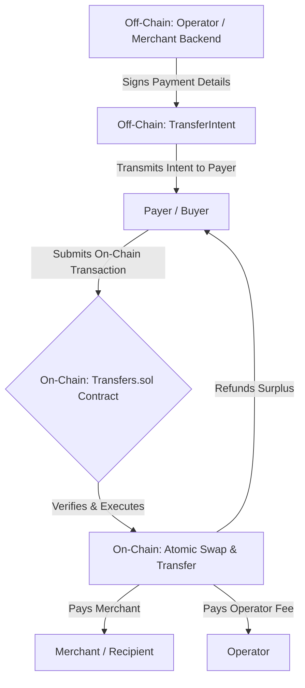

# Onchain Payment Protocol

The Onchain Payment Protocol is a decentralized infrastructure layer that allows payers and merchants to transact with confidence and flexibility, using the blockchain as a secure settlement layer and immutable source of truth.

It fundamentally improves upon traditional cryptocurrency payments by creating an **"intent-based" system**. In this model, payment requirements are defined and signed off-chain, while execution happens atomically on-chain, eliminating common user errors and market risks.

### Key Features & Benefits

- **Atomic Settlement:** Merchants are guaranteed to receive the _exact_ amount requested. Payments are atomic—they either succeed completely, or the transaction reverts entirely. This means no lost funds, no partial payments, and no stuck transactions.
- **Universal Token Payments:** Payers can settle an invoice using **any token** with a liquid market on Uniswap (V2 or V3), even if it's not the token the merchant wants. The protocol handles the conversion seamlessly and transparently within the payment transaction.
- **Guaranteed Price Execution:** For swaps, Payers are fully protected from price volatility and slippage. By setting a `maxWillingToPay` limit, they ensure they never pay more than intended, even in volatile markets.
- **Elimination of Payment Errors:** The protocol's structure makes it impossible for a Payer to accidentally send funds to the wrong address or in an incorrect amount. All payment details are locked into a secure, signed `TransferIntent`.
- **Permissionless & Extensible:** Any entity can register as an "Operator" to build their own payment services on top of the protocol. The architecture is designed to be extended with powerful new features like DEX aggregation and protocol incentives.

---

## How It Works: The Intent-Based Flow

The protocol's core is the elegant separation between payment **authorization** and payment **execution**. This ensures security and flexibility at every step.

1.  **The Operator** (e.g., a merchant's e-commerce platform) defines the terms of the payment: who gets paid, how much, in what currency, and by when.
2.  The Operator cryptographically signs these terms, creating a secure `TransferIntent`.
3.  **The Payer** receives this intent and decides how they want to pay (e.g., with ETH, USDC, or another token). They submit a single transaction to the `Transfers.sol` contract to fulfill the intent.
4.  **The Contract** validates the Operator's signature, ensuring the intent is authentic and unaltered. It then executes the required actions (like swapping tokens) atomically.
5.  If successful, the merchant is paid, the operator fee is delivered, and any surplus funds from the swap are refunded to the Payer, all in one seamless transaction.

---

## Architectural Deep Dive

### Core Components

- **`Transfers.sol`**: The central smart contract that orchestrates all logic. It validates intents, holds funds transiently during a swap, and interacts with external protocols.
- **Uniswap Universal Router**: The powerful and secure entry point for all on-chain swaps. The `Transfers` contract delegates all swap logic to the router, leveraging its ability to interact with both V2 and V3 pools.
- **Permit2 (`contracts/permit2`)**: A dependency from Uniswap used to enable gasless token approvals. Payers can sign an off-chain message (a "permit") to authorize the movement of their tokens, avoiding the need for a separate on-chain `approve` transaction.

### The `TransferIntent` Primitive

This struct is the heart of the protocol. It is signed by the Operator to authorize a payment.

| Field               | Type              | Description                                                             |
| :------------------ | :---------------- | :---------------------------------------------------------------------- |
| `recipient`         | `address payable` | The merchant's address.                                                 |
| `recipientCurrency` | `address`         | The token the merchant wishes to receive (`address(0)` for native ETH). |
| `recipientAmount`   | `uint256`         | The exact amount of `recipientCurrency` the merchant must receive.      |
| `deadline`          | `uint256`         | The Unix timestamp by which the payment must be executed.               |
| `refundDestination` | `address`         | The address to receive any refunds (if different from the Payer).       |
| `operator`          | `address`         | The address of the registered Operator facilitating the payment.        |
| `feeAmount`         | `uint256`         | The fee (in `recipientCurrency`) to be paid to the Operator.            |
| `id`                | `bytes16`         | A unique ID to prevent replay attacks.                                  |
| `signature`         | `bytes`           | The Operator's EIP-712 signature over the hash of all other fields.     |
| `prefix`            | `bytes`           | Optional alternate signature prefix.                                    |

---

## Contract Payment Methods

A frontend must select the appropriate method based on the desired payment flow.

#### Direct Payments

- **`transferNative`**: Pay ETH for an ETH intent.
- **`transferToken`**: Pay with a token for an intent in the same token (uses Permit2).
- **`transferTokenPreApproved`**: Same as above, but uses a standard `approve` flow.

#### Wrapping & Unwrapping

- **`wrapAndTransfer`**: Pay ETH for a WETH intent.
- **`unwrapAndTransfer`**: Pay WETH for an ETH intent (uses Permit2).
- **`unwrapAndTransferPreApproved`**: Same as above, but uses a standard `approve`.

#### Swaps (Single-Hop)

These functions facilitate a single swap on Uniswap V3 to fulfill the payment.

- **`swapAndTransferUniswapV3Native`**: Pay ETH for a token intent.
- **`swapAndTransferUniswapV3Token`**: Pay with a token for an intent in a different token (uses Permit2).
- **`swapAndTransferUniswapV3TokenPreApproved`**: Same as above, but uses a standard `approve`.

> **Understanding Swap Parameters**
> The swap functions require two crucial Payer-side inputs:
>
> - **`maxWillingToPay`**: A safety limit set by the Payer to protect against slippage. The transaction will fail if the cost of the swap exceeds this amount.
> - **`poolFeesTier`**: The Uniswap V3 fee tier (e.g., 3000 for 0.3%) for the pool. This is provided by the Payer at runtime, allowing their client to select the most liquid and cost-effective pool at the moment of transaction.

---

## Roadmap: Future Enhancements

The current protocol provides a strong foundation. The following features represent the next steps in its evolution to become a truly universal payment layer.

#### 1. Multi-Hop Swaps

To allow payment from any token, even without a direct pair to the `recipientCurrency`.

- **Implementation:** The `swapAndTransfer...` functions will be upgraded to accept a full, bytes-encoded `swapPath` instead of a single `poolFeesTier`.
- **Security:** The contract will perform **on-chain path validation** to ensure the provided path starts with the correct output token and ends with the correct input token. This prevents "bait and switch" exploits while providing maximum flexibility.

#### 2. Best Price Execution via DEX Aggregation

To ensure Payers always get the best possible swap rate across the entire DeFi ecosystem.

- **Vision:** Integrate with an on-chain DEX aggregator protocol (e.g., 1inch, 0x). Instead of delegating only to Uniswap, the `Transfers` contract will delegate swaps to the aggregator, which can route a trade across multiple DEXs (Sushiswap, Curve, etc.) to find the cheapest path, all while maintaining the protocol's core security guarantees.

#### 3. Protocol Incentives: The "Pay-to-Win" Lottery

To drive adoption and create a positive feedback loop, a portion of Operator fees will be contributed to a protocol-wide lottery.

- **Mechanism:**
  1.  A small, configurable percentage of every operator fee is automatically sent to a separate `LotteryController` contract.
  2.  At the end of each epoch (e.g., weekly), a provably fair and tamper-proof random number is sourced from **Chainlink VRF**.
  3.  An off-chain service calculates winners based on their weighted contribution to the prize pool during the epoch, avoiding high on-chain gas costs.
  4.  Winners' data is published to the `LotteryController` as a **Merkle Root**, allowing any winner to gas-efficiently claim their prize by providing a Merkle Proof.

---

## Gasless Transactions & Delegated Payments

The Onchain Payment Protocol supports fully gasless transactions, allowing users to authorize payments without needing to hold the network's native gas token (e.g., ETH). This is achieved through a secure meta-transaction forwarding system, where a user can sign a payment message off-chain and delegate the on-chain execution (and gas fee) to a third-party "Relayer".

This feature is critical for user experience, enabling Web2-like interactions where the complexities of gas payments are abstracted away.

### How it Works: The `execute` Forwarder

The protocol exposes a single, universal entry point for all meta-transactions: the `execute(...)` function. This function acts as a trusted forwarder for the contract.

1.  **The User (Signer):** Instead of creating and sending a transaction, the user's wallet constructs the desired function call (e.g., for a swap) and signs a message containing this data, along with their unique nonce.
2.  **The Relayer (Executor):** Any third-party service can act as a Relayer. They take the user's signed message and `functionData`, wrap it in a call to `execute()`, and submit it to the blockchain, paying the gas fee themselves.
3.  **The Contract:** Verifies the user's signature, ensuring authenticity and preventing replays. It then securely executes the user's intended function by setting the transaction's internal context (`_msgSender()`) to be the user's address. This means all internal logic operates as if the user had called the contract directly.

This architecture enables any function within the `Transfers` contract to be executed gaslessly on behalf of a user, without requiring any changes to the core payment logic. The protocol itself is unopinionated about how a Relayer is compensated; this is treated as an off-chain business arrangement.

---

## Security Considerations

Security is the highest priority. The protocol is designed with multiple layers of defense.

- **Signed Intents:** The core security model rests on the Operator's cryptographic signature. No payment can be executed without this authorization, and the intent's data cannot be tampered with.
- **Re-entrancy Protection:** All state-changing external calls are protected by the `nonReentrant` modifier to prevent re-entrancy attacks.
- **Slippage Protection:** The `maxWillingToPay` parameter in swap functions is a critical user-side protection that gives the Payer full control over their maximum costs.
- **Atomic Transactions:** The use of a `try/catch` block around the Uniswap `execute` call ensures that any failure in the external protocol (e.g., a non-existent pool, insufficient liquidity) will cause the entire payment to revert safely, returning all funds to the Payer.
- **Administrative Controls:**
  - **Pausable:** The contract is `Pausable`, allowing the owner to halt all new payments in an emergency.
  - **Sweepable:** A `Sweepable` role can be configured to recover any tokens that might be accidentally sent to the contract address, providing an operational safety net.
- **Audits:** The contract is designed with clear logic and dependencies on battle-tested protocols to facilitate comprehensive security audits.
